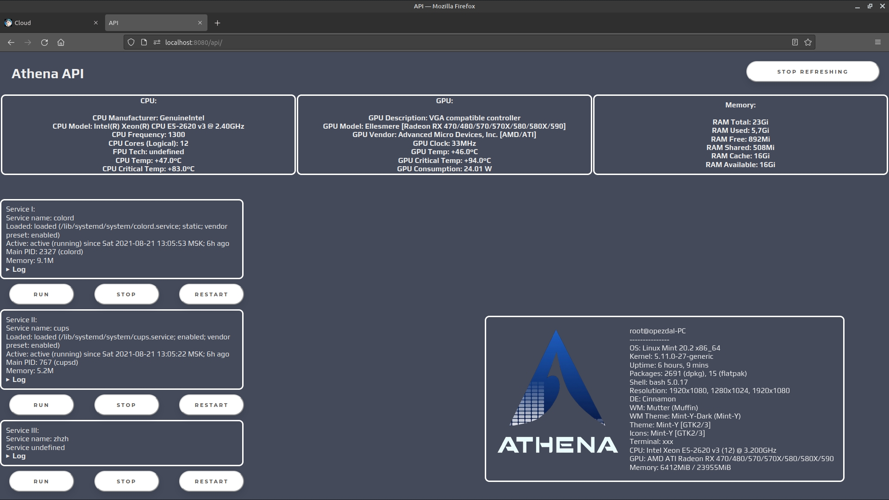

# AthenaWatcher

Observer for your server, created with [Java Spring](https://spring.io/) and GNU/Linux Bash utilities.

[Download last release (.zip)](https://github.com/M4RKERGit/AthenaWatcher/releases/download/v0.1-alpha/AthenaRelease.zip)

## Features:
* Hardware monitoring (CPU, GPU, RAM, Swap, sensors)
* Services monitoring via systemctl and controls (start/stop/restart service)
* TelegramBot notifications
* Logging
* Mailbox notifications
* Cloud with uploading/downloading, can be used like a public storage
* Webpage hosting via AthenaController (only static for now, should be recompiled to replace my page)

## Requirements (can be installed via installation script using apt-get):

* Any Linux Dists, tested on Ubuntu 21.04, Pop!_OS 20.04, Mint 20.2, Manjaro
* Root privileges
* OpenJDK 15 or similar
* Packages: lshw, lm-sensors, neofetch

## Installation:

* Download latest release
* Unzip in any place you want
* Make install.sh an executable file (chmod 777 ./install.sh)
* Run install.sh: that will check JDK version (must be 15 or higher). If there's no JDK or version is below 15, installer will ask you to install OpenJDK 15
* Then installer will install/update needed packages: neofetch, lshw, lm-sensors
* Run .jar with sudo (sudo java -jar Athena.jar)

## Usage:

* localhost:8080/api/ - Main Athena API, resource monitor
* localhost:8080/upload/ - Athena Cloud, uploading and file list
* localhost:8080/ - Index HTML page

[]
